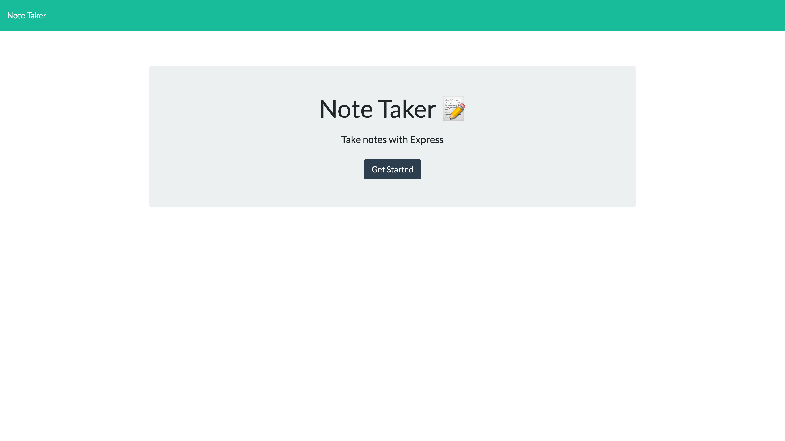
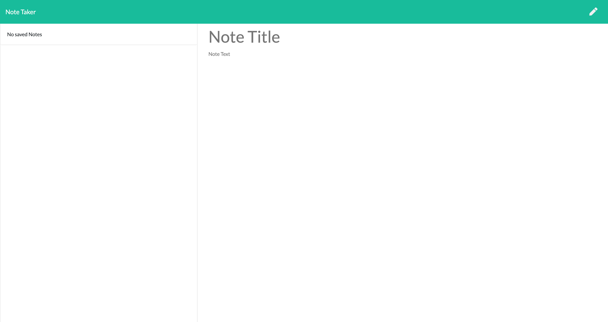
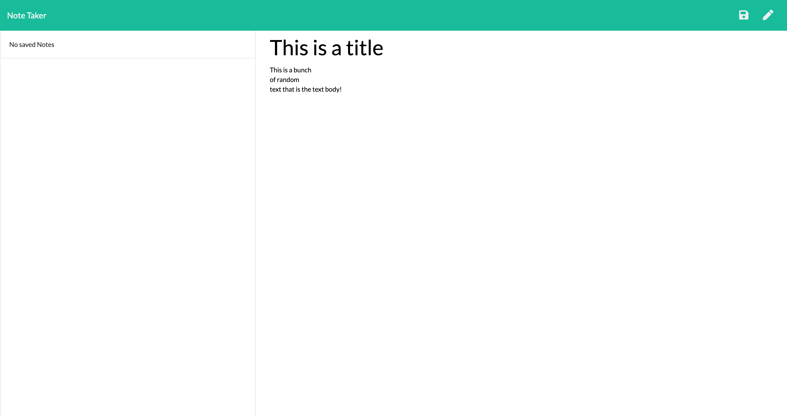
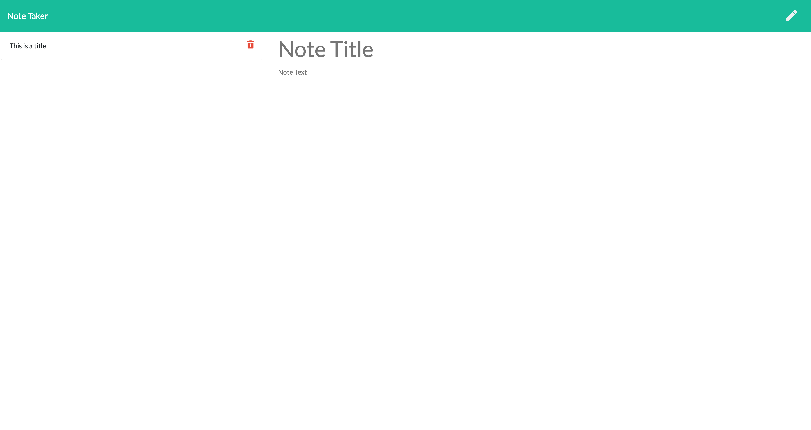
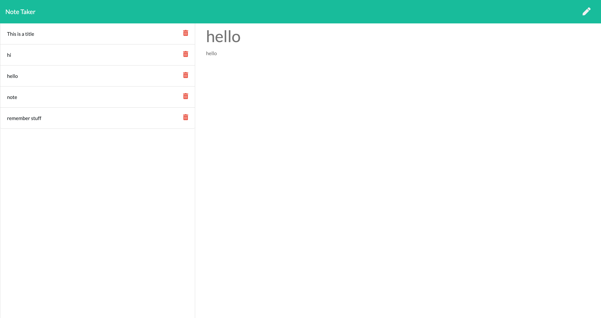
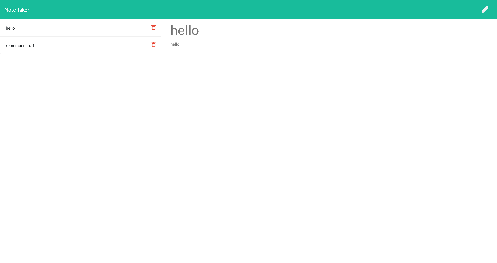
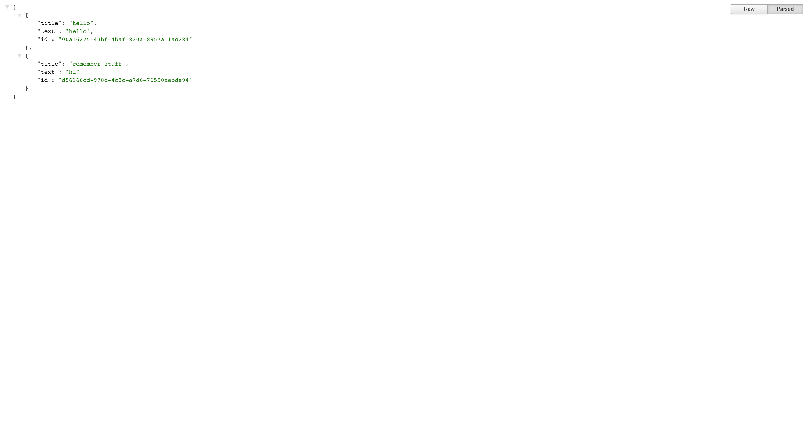

# Note Taker

## Table of Contents: 
- [Description](#description)
- [Installation](#installation)
- [User Story](#user-story)
- [Contributing](#contributing)
- [Tests](#tests)
- [License](#license)
- [Questions](#questions)
<hr>

## Description: 
It is very important to keep track of thoughts and ideas as you go and you can't always rely on your memory. That's where this note taker application comes in. Using a server database to store information, you can insert any note title and note body you would like, click save, and your note is officially pushed to and saved in the database to be retrieved later. You can click on saved notes that are listed on the left hand side to view them or you can delete them when they are no longer necessary. Never forget something again!

<p>Find this project deployed at <a href="https://note-taker-kolton-decker.herokuapp.com/">https://note-taker-kolton-decker.herokuapp.com/</a>.</p>
<p>Find the source code at <a href="https://github.com/koltondecker/Note-Taker">https://github.com/koltondecker/Note-Taker</a>.</p>

<p><a href="https://expressjs.com/">Express</a> was used for this project.</p>
<p><a href="https://www.npmjs.com/package/uuid">UUID</a> was used for this project.</p>

<hr>

### Landing Page

<hr>

### Empty Notes Page

<hr>

### New Note Before Save

<hr>

### New Note After Save

<hr>

### Variety of Notes

<hr>

### Deleting Notes

<hr>

### Database

<hr>

## Installation: 
Upon downloading the files from this repo, use 'npm init' to initialize npm package and 'npm i' to install necessary dependencies for this project.
<hr>

## User Story

```
AS A small business owner
I WANT to be able to write and save notes
SO THAT I can organize my thoughts and keep track of tasks I need to complete
```


## Acceptance Criteria

```
GIVEN a note-taking application
WHEN I open the Note Taker
THEN I am presented with a landing page with a link to a notes page
WHEN I click on the link to the notes page
THEN I am presented with a page with existing notes listed in the left-hand column, plus empty fields to enter a new note title and the note’s text in the right-hand column
WHEN I enter a new note title and the note’s text
THEN a Save icon appears in the navigation at the top of the page
WHEN I click on the Save icon
THEN the new note I have entered is saved and appears in the left-hand column with the other existing notes
WHEN I click on an existing note in the list in the left-hand column
THEN that note appears in the right-hand column
WHEN I click on the Write icon in the navigation at the top of the page
THEN I am presented with empty fields to enter a new note title and the note’s text in the right-hand column
```
<hr>

## Contributing: 
Feel free to contribute to this project in whatever ways you see beneficial. I will review pull requests and update with appropriate additions.
<hr>

## Tests: 
No tests were used for this project.
<hr>

### License: 
No license was used for this project. 
<hr>

### Questions: 
If you would like to learn more, please take a look through my github below:
<a href="https://github.com/koltondecker"> </a>Visit my GitHub at <a href="https://github.com/koltondecker">github.com/koltondecker</a>
If you still have questions, please send me an email and I will respond as soon as I can:
<a href="mailto:deckerman25@gmail.com">deckerman25@gmail.com</a>